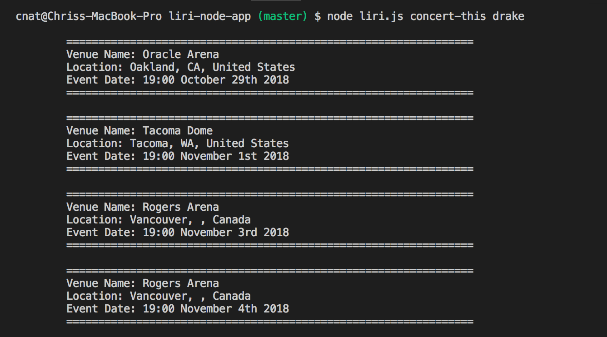
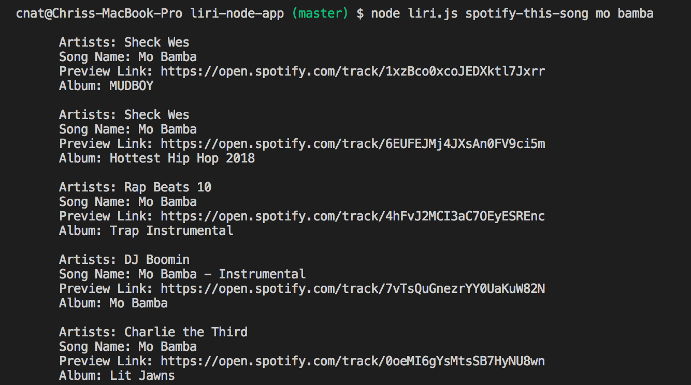
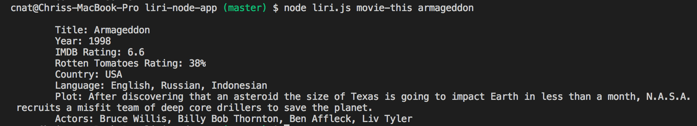
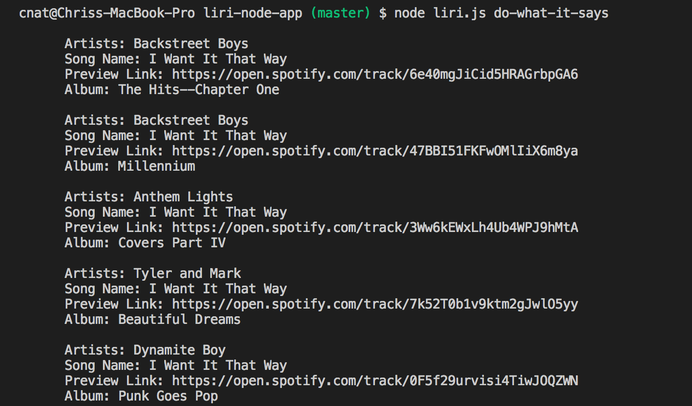

# liri-node-app

Liri is an app that takes in node commands to search for concert information and venues, songs on spotify, movie information, or a random command using either of the following:

<ul>
<li>concert-this "artist name"</li>
<li>spotify-this-song "song title"</li>
<li>movie-this "movie title"</li>
<li>do-what-it-says</li>
</ul>

<h2>Concert this</h2>

<h2>Spotify this song</h2>

<h2>Movie this</h2>

<h2>Do what it says</h2>

<h2>Video tutorial</h2>

https://drive.google.com/file/d/1kOTpRkRwa2N2MB2zvO4luqpF8v6YE0cH/view

